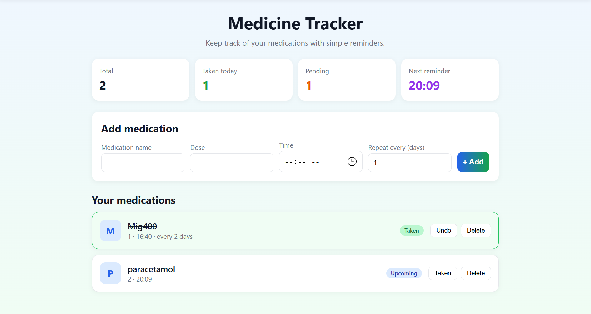

# Medication Reminder

A web app that helps users keep track of their daily medications and reminds them when it's time to take a dose.

## Features

- Add medications with name, dose, time and repeat interval (every N days)
- Daily list sorted by time, with status: upcoming, due, overdue, taken
- Stat cards: total, taken today, pending, next reminder
- Mark doses as taken (with undo) and delete medications
- Browser notification when a dose is due (requires permission)
- Data saved in the browser with localStorage

## Built with

HTML, CSS and vanilla JavaScript (no frameworks)

## How to run

Open `index.html` in a browser.

## What I learned

- DOM manipulation and event handling
- Working with arrays and objects
- Saving and loading data with JSON and localStorage
- Time-based logic with setInterval
- Browser Notifications API

## Background

This project is a web version of my embedded Medication Reminder System, originally built in C with a real-time clock module.
